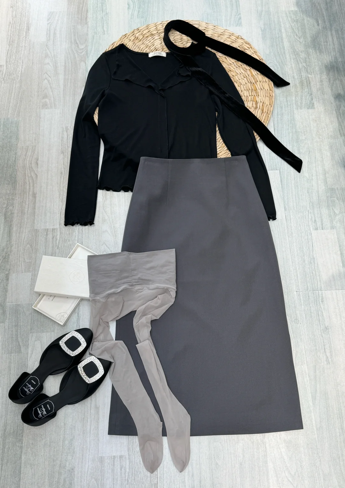
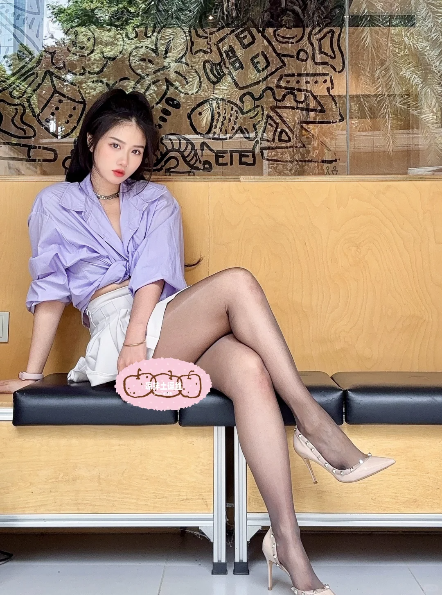
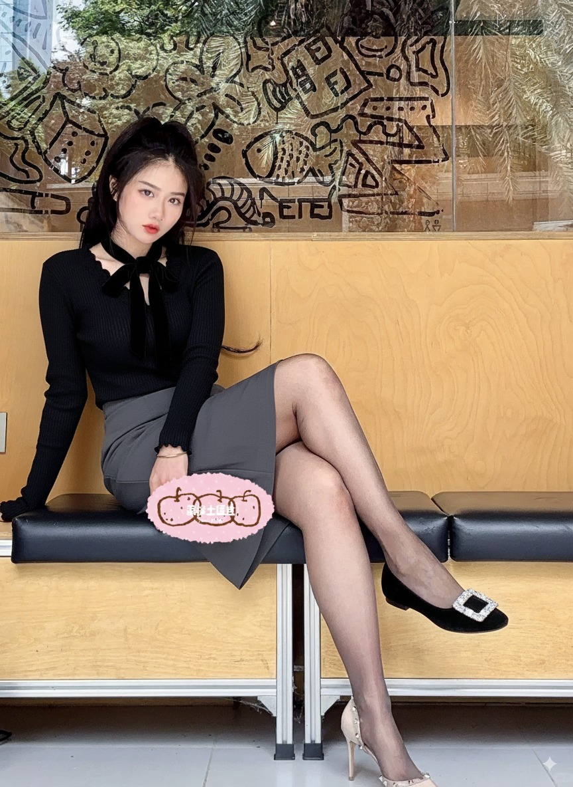

## input
image1



image2 


prompt
```
The character in Figure 2 is wearing the clothing and accessories from Figure 1. This includes all items of clothing, such as shoes and stockings, and any other adornments
```

## result


## author
[歸藏](https://x.com/op7418)