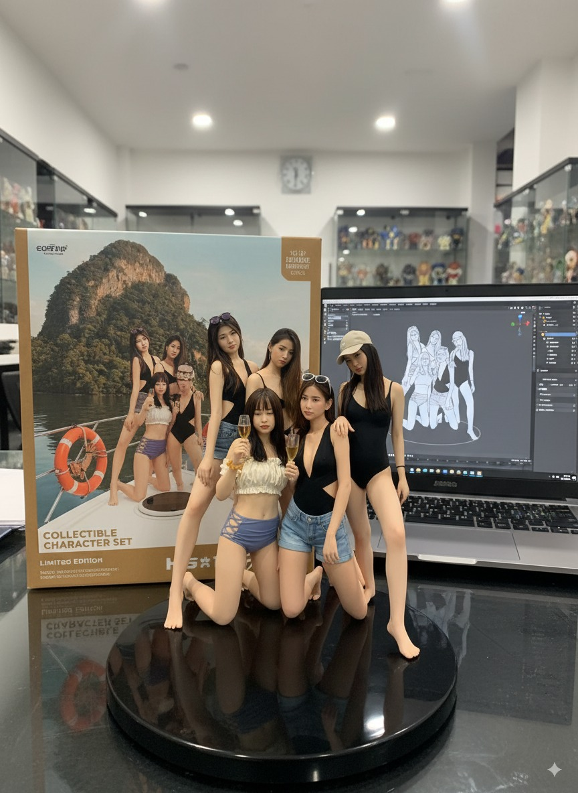

## input


prompt
```
turn this photo into a character figure. Behind it, place a box with the character’s image printed on it, and a computer showing the Blender modeling process on its screen. In front of the box, add a round plastic base with the character figure standing on it. set the scene indoors if possible
```

## result


## author
[-Zho-](https://x.com/ZHO_ZHO_ZHO)